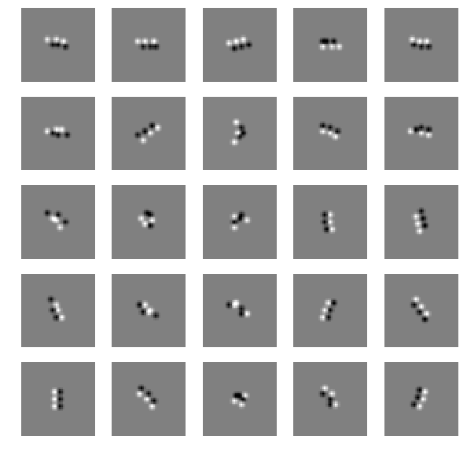
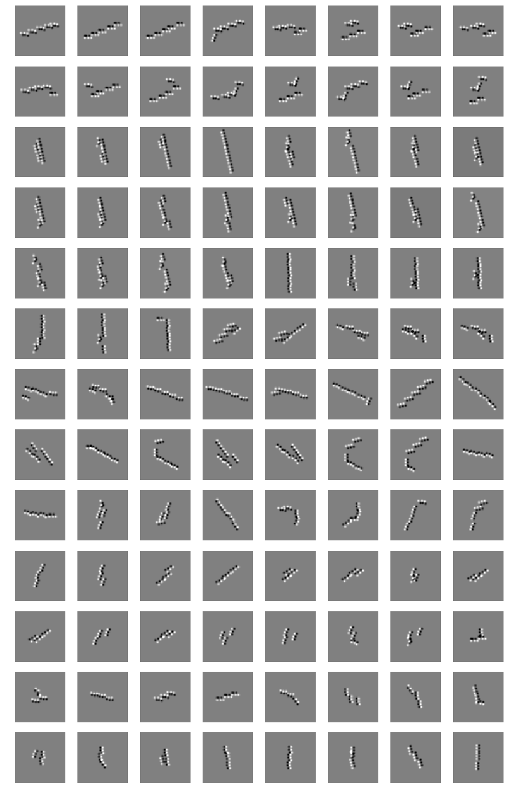
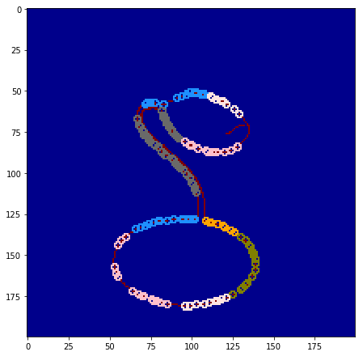

# Learning hierarchical features in RCN (Recursive Cortical Network)

Paper: A generative vision model that trains with high data efficiency and
    breaks text-based CAPTCHAs. D. George*, W. Lehrach, K. Kansky, M. Lázaro-Gredilla*,
    C. Laan, B. Marthi, X. Lou, Z. Meng, Y. Liu, H. Wang, A. Lavin, D. S. Phoenix  
    (http://science.sciencemag.org/content/early/2017/10/26/science.aag2612)  
 
Input images (.png) are rendered from SHREC 2012 3D objects files (.off). See 'sample_images' directory.  
 
### F2 features

### F3 features

Explain an image with F3 features:

